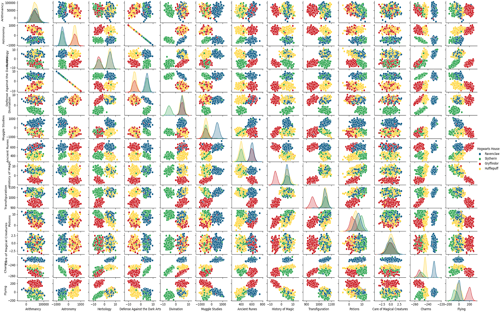
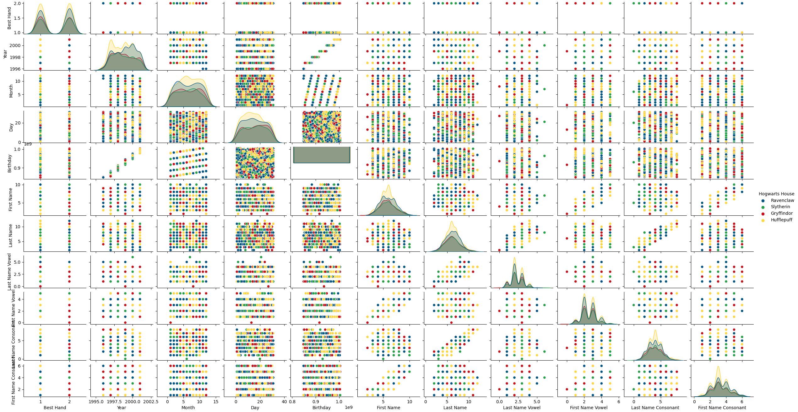
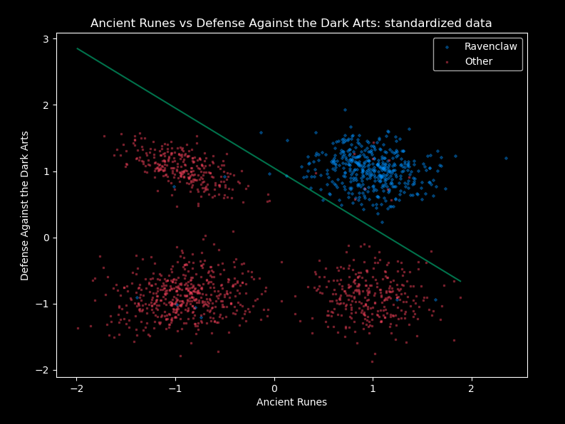
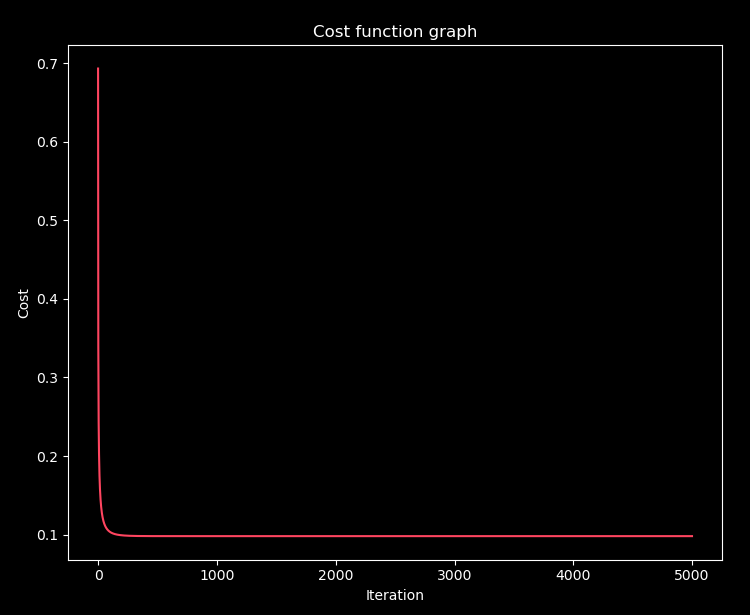
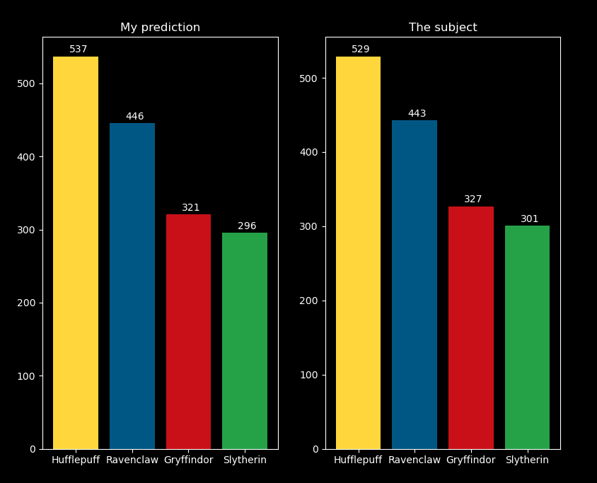
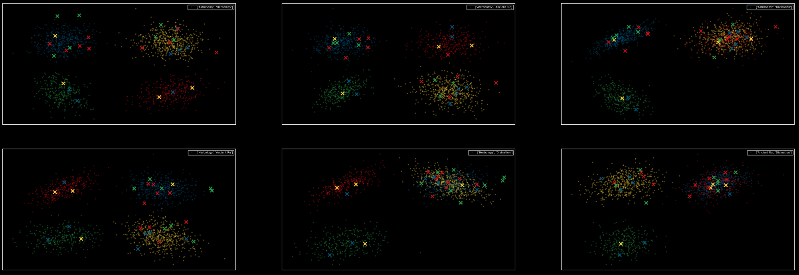

# DSLR
DataScience x Logregistic Regression - School-42 project

#### Goals:
* Learn how to read a dataset, to visualize it in different ways, to select and clean unnecessary information from your data.
* Implement one-vs-all logregistic regression that will solve classification problem
* Every function that do the work for us is forbidden (predict, sigmoid, mean, ..), and must be recoded by hand

Look at [subject.pdf](assets/fr.subject.pdf) for more information

## Requirements:
* `Python 3`
* `NumPy`
* `Pandas`
* `Matplotlib`
* `SeaBorn`

## Setup:
```
git clone https://github.com/LudovicLemaire/DSLR.git
cd DSLR
pip3 install pandas numpy matplotlib seaborn
```

### Data description
These are some visualizations for dataset:

|[describe.py](describe.py)      |[describe_object.py](describe_object.py)      |
|--------------------------------|----------------------------------------------|
|||

|[scatter_plot.py‎‎‎‎](scatter_plot.py)   ‎‎‎‎‎                  |[scatter_plot_house.py](scatter_plot_house.py)             |[scatter_plot_house_upgraded.py](scatter_plot_house_upgraded.py)      |
|-------------------------------------------------------|-----------------------------------------------------------|----------------------------------------------------------------------|
|               |       ||
|Show values for two courses using Cartesian coordinates|Same but with color for houses and without useless features|Show features I will use                                              |

|[pair_plot.py](pair_plot.py)      |[pair_plot_useless.py](pair_plot_useless.py)                                                 |
|----------------------------------|---------------------------------------------------------------------------------------------|
||                                           |
|Pair plot from SeaBorn            |Tried to find if I could use birthday, names, best hand in some way, but they are all useless|

### Training phase
These are some visualizations during training:
|[logreg_train.py](logreg_train.py)                    |[logreg_train.py](logreg_train.py)                |
|------------------------------------------------------|--------------------------------------------------|
|||
|Result once training is made between 2 features       |Cost function                                     |

### Predict phase
These are some visualizations during prediction:
|[logreg_predict.py](logreg_predict.py)             |[scatter_plot_house_error.py](scatter_plot_house_error.py)      |
|---------------------------------------------------|----------------------------------------------------------------|
|       ||
|Compare my prediction with the initial training csv|Show every failed prediction                                    |