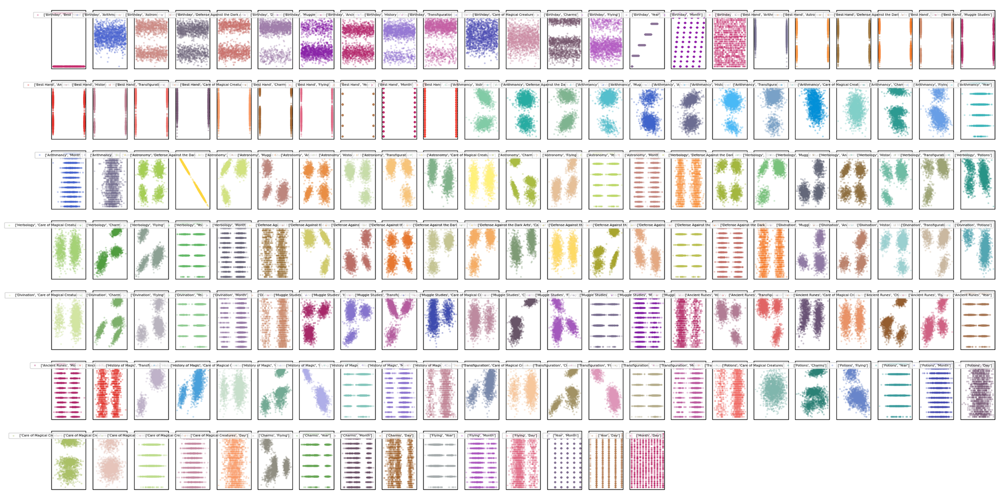
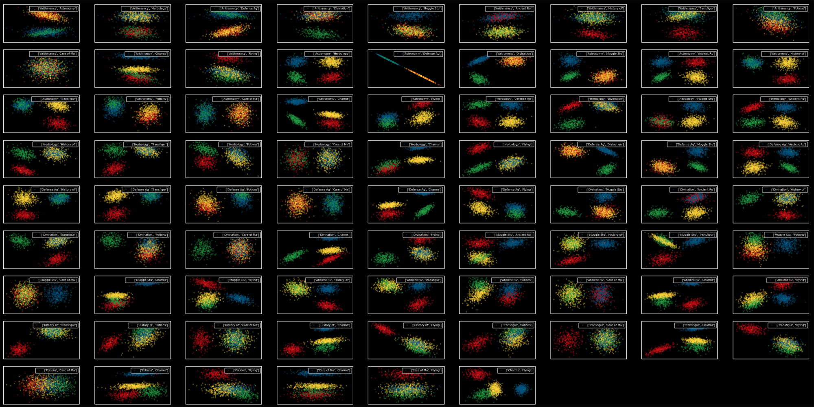
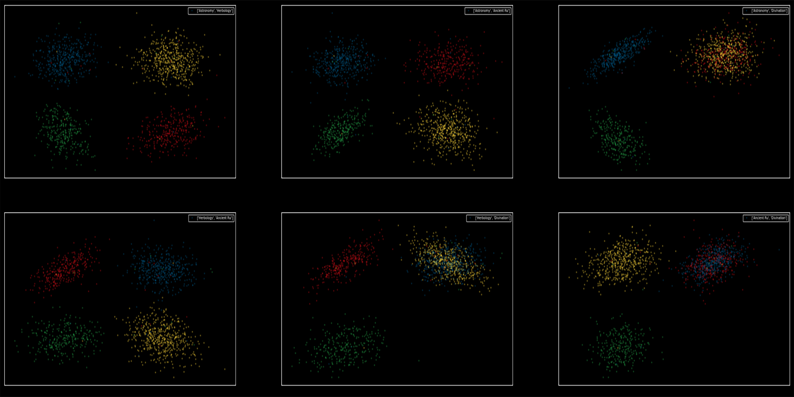

# DSLR
DataScience x Logistic Regression - School-42 project

#### Goals:
* Learn how to read a dataset, to visualize it in different ways, to select and clean unnecessary information from your data.
* Implement one-vs-all logistic regression that will solve classification problem

Look at [subject.pdf](assets/fr.subject.pdf) for more information

## Requirements:
* `Python 3`
* `NumPy`
* `Pandas`
* `Matplotlib`
* `SeaBorn`

## Setup:
```
git clone https://github.com/LudovicLemaire/DSLR.git
cd DSLR
pip3 install pandas numpy matplotlib seaborn
```

### Data description
This are some visualizations for dataset:

|[describe.py](describe.py)      |[describe_object.py](describe_object.py)      |
|--------------------------------|----------------------------------------------|
|||

|           [scatter_plot.py             ](scatter_plot.py)                      |[scatter_plot_house.py](scatter_plot_house.py)      |[scatter_plot_house_upgraded.py](scatter_plot_house_upgraded.py)      |
|--------------------------------------------------------|----------------------------------------------------|----------------------------------------------------------------------|
|                |||
| Show values for two courses using Cartesian coordinates|Same but with color for houses                      |Only the one I will use                                               |
